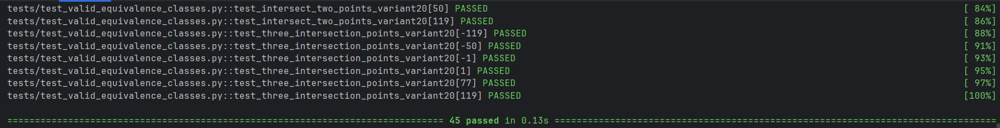
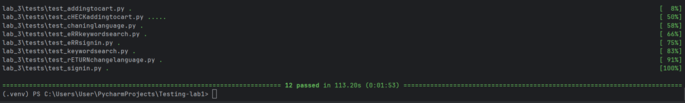

## LAB 3 - TESTING own code implementation

Start all tests within **lab_1/tests/** folder
* Command: `python -m pytest -v`

## LAB 3 - TESTING [agro-yakist.com](https://agro-yakist.com.ua/) with Selenium

Start all tests within **lab_3/tests/** folder
* Command: `pytest lab_3/tests/`

